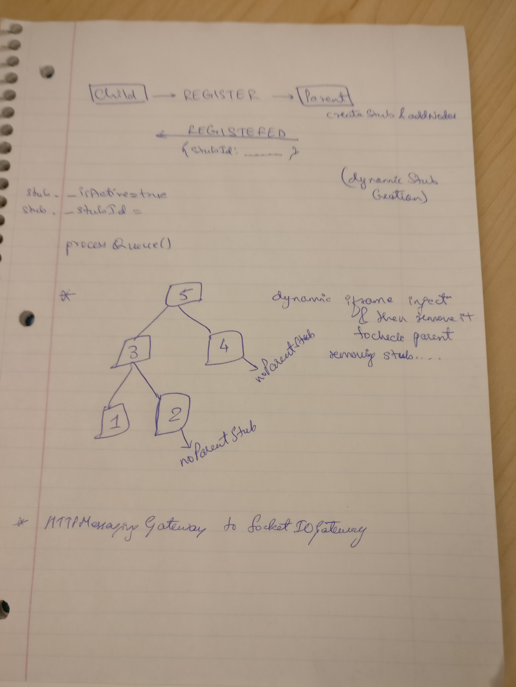

Setup

- Heartbeat service is disabled in node 6 (6.html) and node 3
- After all registration has completed i.e.
    - 1 and 6 registered at 3
    - 3 registered at 5 (3 doesn't have HeartbeatService registered)
- node 1 sends a heartbeat to node 3
- node 3 propagates this heartbeat to node 6 and node 5, otherwise there's some bug